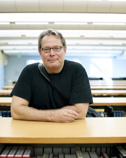

## Welcome to the IoES. 
You have all heard or read the mantra – billions more people to be added to the planet, water scarcity, global warming, species going extinct, and on and on. It makes one wonder, what is the point. At IoES we see that gloomy mantra as a challenge, not a forecast or prophecy. There are more green business jobs than ever before. Venture capital funds and pension funds are investing in sustainable businesses all around the world. The Kentucky Coal Museum has installed solar panels for its energy. Cities are expanding urban parks at an unprecedented rate. Los Angeles is starting the most ambitious river restoration project ever undertaken in the world. The 2028 Olympics hosted in Los Angeles will leave a legacy of sustainability in one of the most biodiverse and culturally diverse corners of the world.

It is always the young that are agents of change. At IoES we are committed to giving you the tools and skills, and the intellectual sophistication to tackle really, really complex environmental problems. We do not just want you to succeed, we expect you to succeed and we will help you exceed. This guidebook is complicated because there are so many different pathways to making an environmental difference, and so many different disciplines that can be your vehicle. One thing that cuts across all environmental advance and progress is the need to excel at communication — that means telling stories and visualizing information in compelling ways. It also mean listening. UCLA is a big university. Take advantage of that to hear different views and to try your hand at telling stories about the environment. Again we will help.

Lastly, as someone who has worked for the federal government, for non-profit organizations, for private business, and for nearly ten different universities, I want to assure you that if you embrace the intellectual challenges and cultural diversity of IoES, there is a career for you – a career that is fun, rewarding, and makes a difference.

Best of luck on what will surely be a tortuous journey. A straight line might be the shortest path, but rarely is it the most interesting path.

Peter Kareiva, director  
UCLA Institute of the Environment and Sustainability

